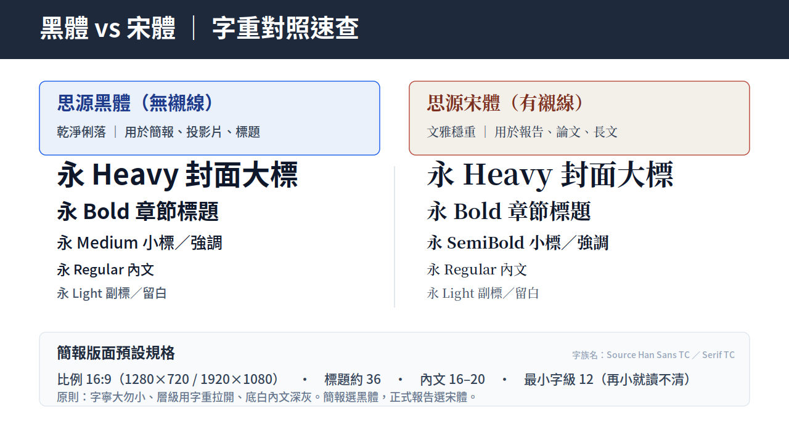

# 懶人包_用 Claude 做專業簡報

一套讓任何人都能用 Claude 快速做出「不帶 AI 味、配色一致」專業簡報的開源懶人包。
免費、可商用、適合教學與自學。
---

## 開始只有兩步

### ① 下載字型並安裝

中文簡報要好看，第一步是換掉系統預設字型。下面是 Adobe 官方免費正版字型，點一下就開始下載：

| 字型 | 一鍵下載 | 用在哪 |
| --- | --- | --- |
| **思源黑體** | **[⬇️ 下載思源黑體](https://raw.githubusercontent.com/adobe-fonts/source-han-sans/release/OTF/TraditionalChinese/SourceHanSansTC-Regular.otf)** | 簡報、投影片、標題 |
| **思源宋體** | **[⬇️ 下載思源宋體](https://raw.githubusercontent.com/adobe-fonts/source-han-serif/release/OTF/TraditionalChinese/SourceHanSerifTC-Regular.otf)** | 報告、論文、印刷長文 |

**最快安裝法**：下載 `.otf` 後，直接把檔案拉進 Claude 對話框，打一句「**幫我安裝**」即可。
想裝到自己電腦的 PowerPoint / Word，請看 → [字型安裝懶人包](字型安裝懶人包.md)

### ② 直接套用簡報風格

字型裝好後，打開 [簡報指令範本](簡報指令範本.md)，複製一段提示詞、改掉【主題】貼進 Claude，就能產出可下載的 PPTX。範本裡的配色、字型、頁尾名牌都能換成你自己的。

> 上圖：簡報選黑體、報告選宋體；版面用標準 16:9，標題約 36、內文 16–20、最小字級不低於 12。

---

## 懶人總結（記這一句就好）

**點上面下載字型 → 拉進 Claude 打「幫我安裝」→ 複製 [指令範本](簡報指令範本.md) → 改主題 → 出簡報。** 完。

---

## 想挑配色？

不知道要用什麼顏色時，往下看 [簡報指令範本](簡報指令範本.md) 最下方的「10 款專業配色建議」，依你的產業／場合挑一組，把色碼貼進提示詞即可。

> 重點觀念：**配色不要用形容詞，要用色碼。** 只寫「深藍」AI 每次會猜不同的藍；把十六進位色碼（例如 `#1E2761`）寫進提示詞，產出才一致、可重現。

---

## 檔案導覽

| 想知道什麼 | 看這篇 |
| --- | --- |
| 怎麼安裝、要選黑體還是宋體 | [字型安裝懶人包](字型安裝懶人包.md) |
| 簡報指令範本、配色建議 | [簡報指令範本](簡報指令範本.md) |

---

授權：字型為 Adobe 思源系列（SIL Open Font License，免費可商用）。本懶人包文件以 CC BY 4.0 釋出，歡迎自由取用、改作、教學使用。
